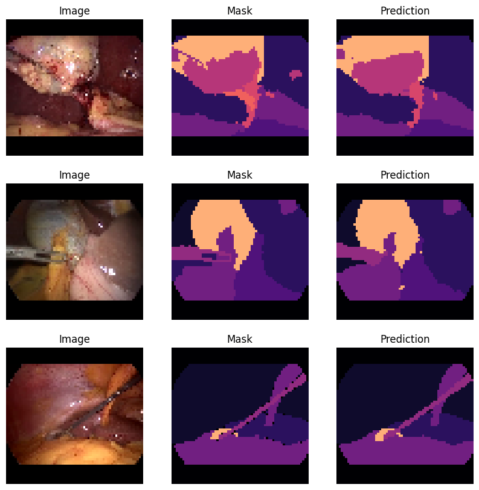
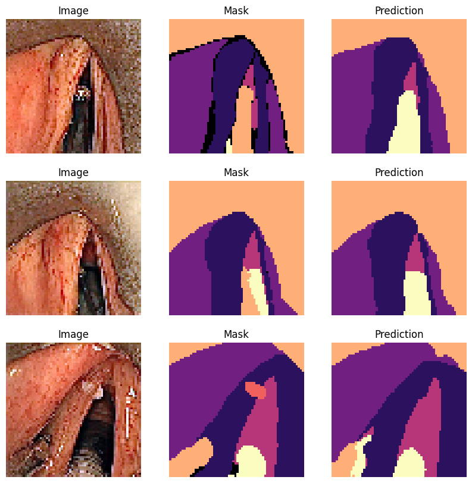

# TFG-TSI-AGM

---

## Description

This repository has all the source code written for the development of a final proyect.

## Abstract

The versatility of Transformer-based architectures is the main emphasis of this project, which develops and contrasts several deep learning models. Several adjustments are made to the Uformer model as a starting point to evaluate the flexibility and effectiveness of these models. The changes are intended to reduce the number of parameters in the model, which will lighten its memory requirements and simplify its complexity. These changes consist of testing different blocks of Transformers, as well as testing training techniques that are more lightweight. The aim is to investigate whether attention is the driving force that gives Transformers their high efficiency, or whether it is due to the depth of the models. To evaluate performance in different environments, two different data sets are used for training. Various metrics, tables and graphs are used to represent the data and draw conclusions.

## Resumen

La versatilidad de las arquitecturas basadas en Transformer es el principal énfasis de este proyecto, que desarrolla y contrasta varios modelos de aprendizaje profundo. Se realizan varios ajustes en el modelo Uformer como punto de partida para evaluar la flexibilidad y eficacia de estos modelos. Los cambios pretenden reducir el número de parámetros del modelo, lo que aligerará su necesidad de memoria y simplificará su complejidad. Estos cambios consisten en probar diferentes bloques de Transformers, así como probar técnicas de entrenamiento que sean más ligeras. Se pretende investigar sobre si la atención es el motor que otorga a los Transformers su gran eficiencia, o si bien, esta se debe a la profundidad de los modelos. Para evaluar el rendimiento en distintos entornos, se emplean dos conjuntos de datos distintos para el entrenamiento. Se utilizan diversas métricas, tablas y gráficos para representar los datos y extraer conclusiones.

---

---

Alejandro García Mota.
